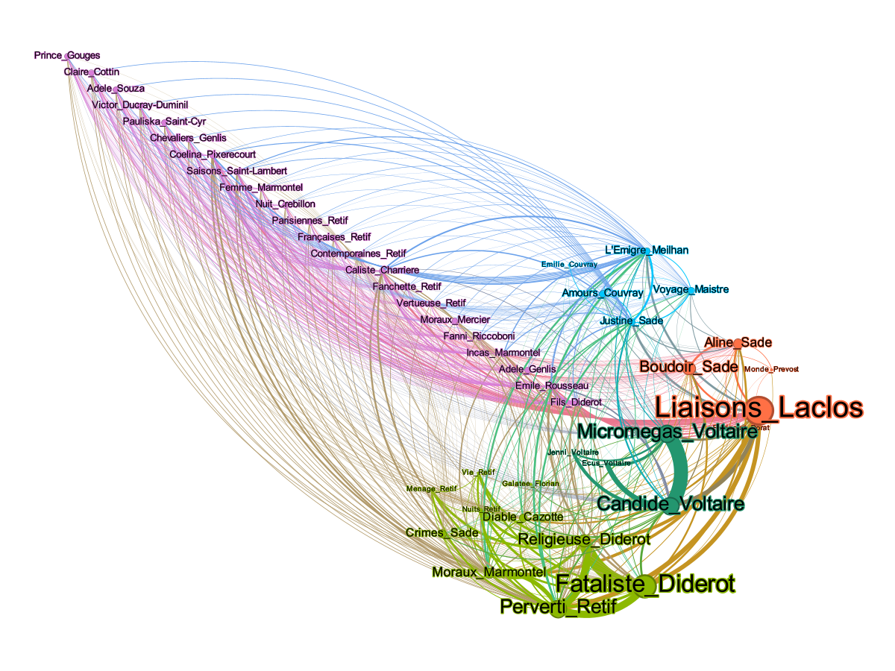

# lit_cooccurence

This repository aims to analyze the relationships between literary works mentioned in scholarly works. Based on their co-occurrence, we can gain insights into how the works are related to each other. Furthermore, the analysis will provide insights into the scope and coverage of certain scholarly works.

The Python script `cooccurrence.py` can be used to process the input file `work_title.tsv` and generate a Gephi file named `work_title_graph.gephi` that can be seamlessly opened using the [Gephi](https://gephi.org/). To get a better understanding of the output, you can refer to an example visualization `work_title_cooccurrence.png`:

